# Spark using Java

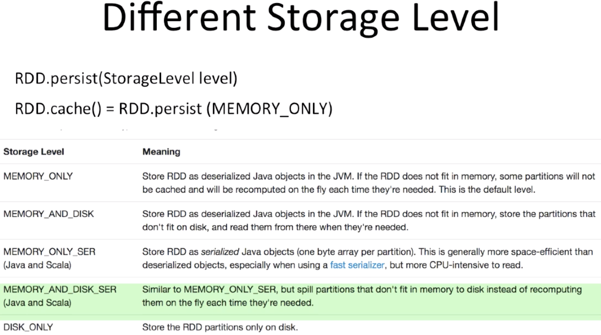

# Spark Architecture
* Uses Master Slave Architecture
* In typical Spark cluster, there is 1 Master node(Driver) and number of worker nodes
* 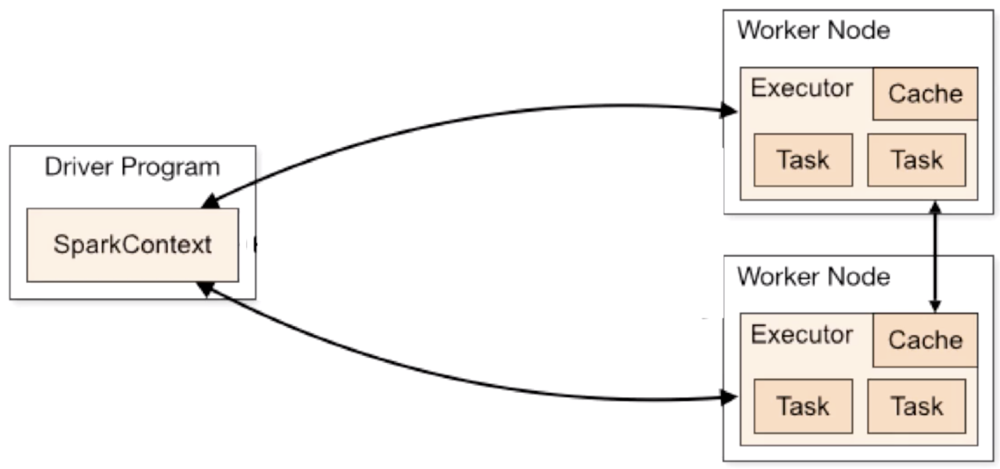
* Each of the executors runs in there own java processes
* Driver Program is process where main method runs
* Driver Program converts user program into task and schedule task on work nodes
* Each driver program execution is called Job
* So, Driver Program is responsible for receiving job and convert job into task
* Executors are initialized when application in launched
* When worker node runs the task, they sends back result to Driver Program
* Driver Program connects to Spark cluster using Spark Context and apply RDD operations on cluster
* Driver Program controls all the operations on RDD in Spark job
* 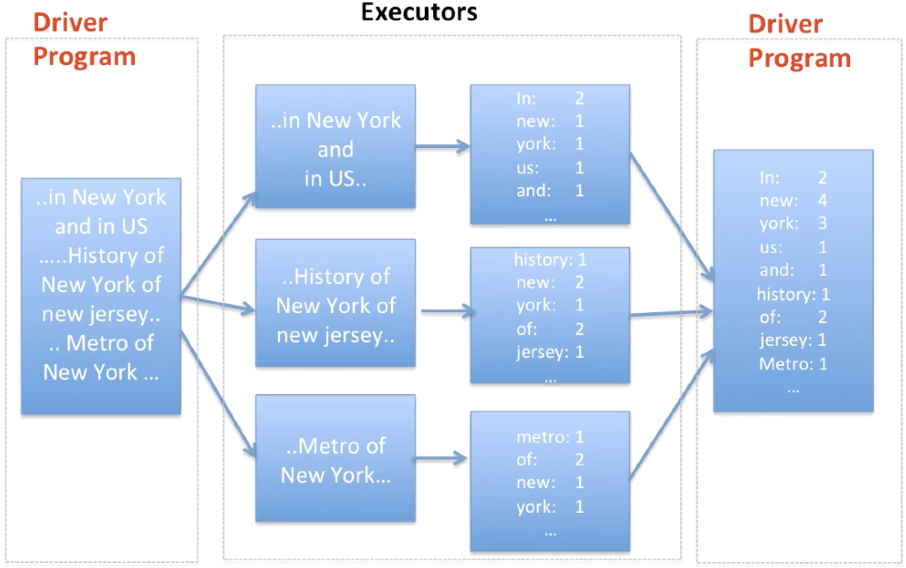

# Spark Components
* Spark Project contains multiple integrated components, Let's see some of them
* 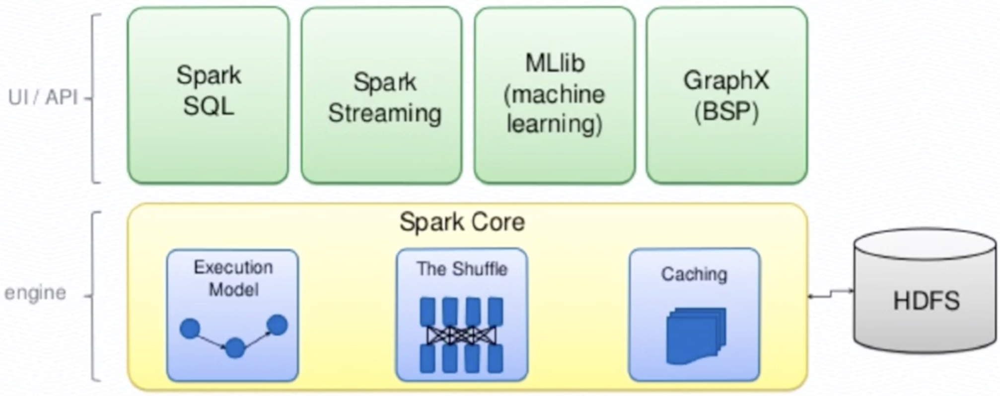

* **Spark SQL**
* Spark pkg designed for working with structured data which is built on top of Spark Core
* Provides an SQL-like interface for working with structured data
* Internally could trigger several RDD operations on Spark
* **Spark Streaming**
* Running on top of spark, spark streaming provides an API for manipulating data streams that closely match the Spark Core's RDD API
* Enables powerful interactive and analytical applications across both streaming and historical data while inheriting Spark's ease of use and fault tolerance characteristics
* Spark can integrate with wide variety of clusters including Twitter, Flume, Kafka, HDFS etc.
* **ML Lib**
* Usable in Java, Scala and Python as a part of Spark Applications
* Build on top of Spark, MLlib is a scalable ML library that delivers both high-quality algorithms and blazing speed.
* Consists of common learning algorithms and utilities, including Classifications, Regression, Clustering, Collaborative filtering and dimensionality reduction, etc.
* **Who use Apache Spark and how?**
* Data Scientist
* Data Processing Applications Engineers

# Introduction to Pair RDDs 
**Pair RDD**
* A lot of datasets we see in real life examples are usually key value pairs.
* Examples:
> A datasets which contains passport IDs and the names of the passport holders
> A dataset contains course names and list of students who enrolled in the courses
* Typical pattern is key to one value or multiple values
* Spark provides a data structure called pair RDD instead of regular RDDs, which makes working with this kind of data more simpler and more efficient
* A pair RDD is perticular type of RDD that can stores key-value pairs
* Pair RDDs are useful building blocks in many spark programs

**How to create Pair RDDs**
* Two Popular ways to create pair RDDs
* 1. Returns Pair RDDs from list of key value data structure called tuple
* 2. Turn regular RDD into Pair RDD
* Java doesn't have a build-in tuple type, so Spark's Java API allows users to create tuples using the scala.Tuple2 class

**Transaformation on Pair RDDs**
* Pair RDDs are allowed to use all transformations available to regular RDDs, and thus support the same functions as regular RDDs
* Since pair RDDs contains tuples, we need to pass function that operates on tuples rather than on individual elements
* When our dataset is described in the format of key-value pairs, it is quite common that we would like to aggregate statistics accross all elements with the same key
* We have looked at the _reduce_ actions on regular RDDs, and there is a similar operations for pair RDD, it is called _reduceByKey_
* _reduceByKey_ runs several parallels _reduce_ operations, one for each key in the dataset, where each operation combines values that have the same key
* Considering input datasets could have a huge number of keys, _reduceByKey_ operations is not implemented as an action that returns a value to the driver program. Instead, it returns a new RDD consisting of each key and the reduced value for that key
* * 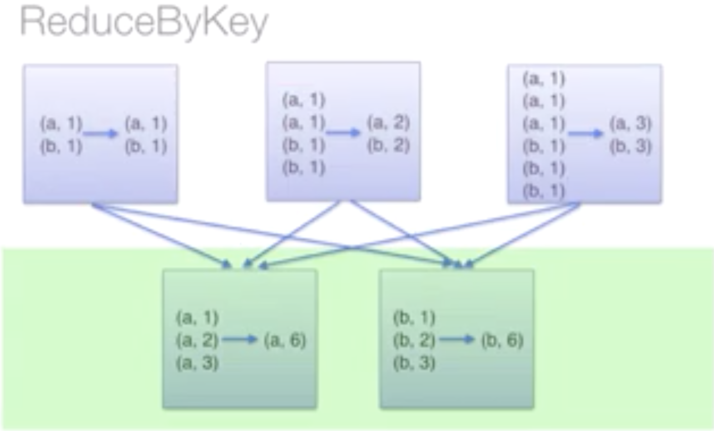
* _groupByKey_ A common use case for pair RDD is grouping our data by key. For example, viewing all of an account's transactions together
* If our data is already keyed in the way we want, _groupByKey_ will group our data using the key in our pair RDD.
* Let's say, the input pair RDD has keys of type K and values of type V, if we call _groupByKey_ on the RDD, we get back pair of RDD of type K, and iterable V.
* _public JavaPairRDD<K, Iterable<V>> groupByKey()_
* _reduceByKey_ is preferred when there is large data against _groupByKey_
* 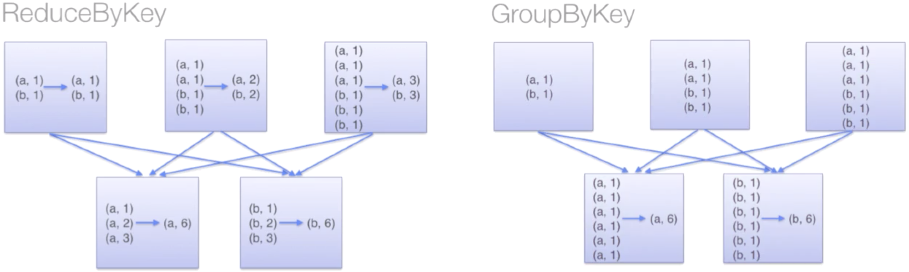
* _sortByKey_ Transformation

**Data Partitioning**
* _reduceByKey_ all worker nodes process it's partitions and shuffle data for final results whereas _groupByKey_ oeprations all worker nodes first shuffle data and final nodes finds results, So using _groupByKey_ can cause lots of unnecessary data shuffling and can have performance hit on large data
* Is there any way to reduce amount of shuffle in _groupByKey_? Yes, we do.
* We can use _HashPartitioner_ to use data data on same worker, so we can do partition using key of Pair RDD
* _partitionBy_ method on RDD, return copy of Pair RDD using specified partitioner
* _JavaPairRDD<String, Integer> partitionedWordPairRDD = wordPairRdd.partitionBy(new HashPartitioner(4));_
* No matter how many times _groupByKey_ you called data with same key will appear on same node 
* It is very important to persist partition information to disk, without it method will re-evaluate partitions again
* _partitionedWordPairRDD.persist(StorageLevel.DISK_ONLY())

**Which Operations would benefit from Partitioning**
* Many of spark operations involved shuffling data across network
* All of these will benefit, this is not complete list of operations. _join_ _leftOuterJoin_ _rightOuterJoin_ _groupByKey_ _reduceBykey_ _combineByKey_ _lookup_
* Running _reduceByKey_ on a pre-partitioned RDD will cause all the values for each key to be computed locally on a single machine, requiring onlt the final, locally reduced value to be sent from each worker node back to the master.

**Operationa which would be affected by partitioning**
* Operations like map could cause the new RDD to forget the parents partitioning information, as such operations could, in theory, change the key of each element in the RDD.
* General guidance is to prefer _mapValues_ over _map_ operation

**Join Operations**
* Join operation allows us to join two RDDs together which is probably one of the most common operations on a Pair RDD
* Join Types: _leftOuterJoin_, _rightOuterJoin_, _crossJoin_, _innerJoin_, etc.
* If both RDDs have duplicate keys, join operation can dramatically expand size of the data. It's recommended to perform a _distinct_ or _combinedByKey_ operation to reduce the key space if possible.
* Join Operation may require large network transfers or even create data sets beyond our capabilities to handle
* Joins in general, are expensive since they require that corresponding keys from each RDD are located at the same partition so that they can be combined locally. If the RDDs do not have known partitioner, they would need to shuffle so that RDDs share a partitioner and data with same key lives in same partitions 

**Accumulators**
* Accumulators are variables that are used for aggregating information across the executors. For example, we can calculate how many records we can calculate how many records are corrupted or count events that occur during job execution for debugging purposes
* Tasks on worker node can not access accumulator value
* Accumulators are _write-only_ variables
* This allows accumulators to be implemented efficiently, without having to communicate every update

**Alternative to Accumulators**
* Using accumulator is not only way to solve this problem
* It is possible to aggregate values from an entire RDD back to the driver program using actions like _reduce_ or _reduceByKey_

**Different Types of accumulator**
* Out of the box, Spark supports several accumulators of types such as _Double_ and _Long_
* Spark also allows to have custom accumulator types and custom aggregation operations such as finding the maximum of the accumulated values instead of adding them
* You will need to extend the _AccumulatorV2_ abstract class to define your custom accumulators
* Link: _https://spark.apache.org/docs/preview/api/java/org/apache/spark/util/AccumulatorV2.html_

**Broadcast Variables**
* Broadcast variables allow the programmer to keep a read only variable cached on each machine rather than shipping copy of it with tasks.
* They can be used, for example, to give every node, a copy of a large input dataset, in an efficient manner
* All broadcast variables will be kept at all the worker nodes for use in one or more spark operations
* * 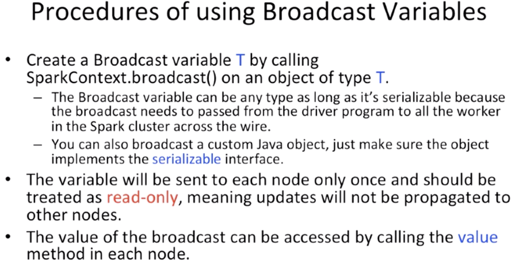
* * 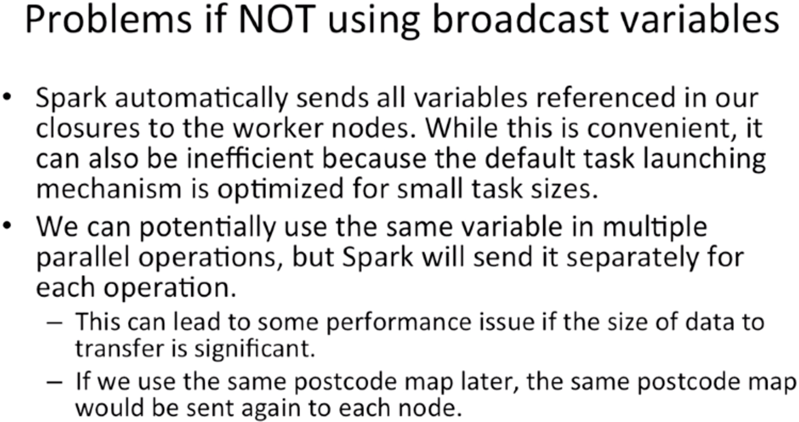

**Introduction to Running Spark In Cluster**
* * 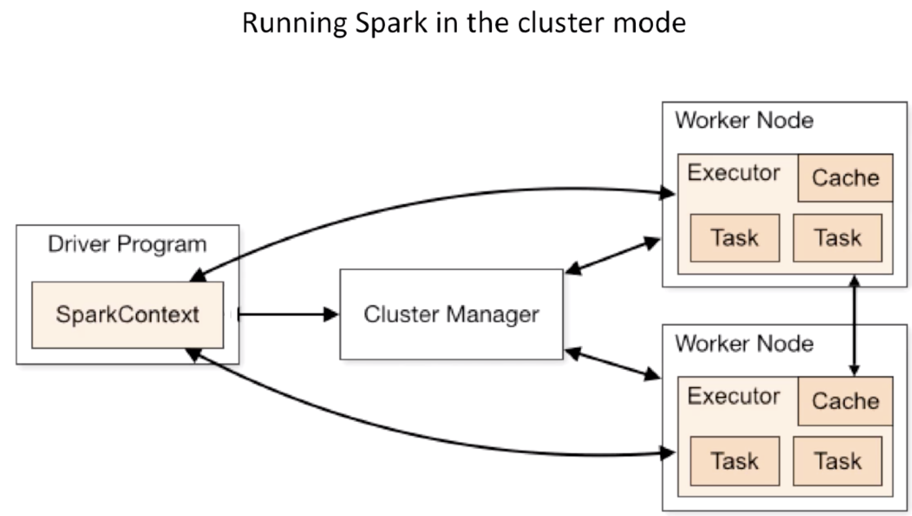
* The machine where Spark application is running is called _Driver Machine_
* Another machine where cluster manager is running is called _Master node_
* _Worker Node_ reports available resources to _Master Node_
* _Cluster Manager_ is pluggable component
* Spark is packaged with a build-in cluster manager called the _Standalone Cluster Manager_
* There are other types of Spark Manager master such as -
* _Hadoop Yarn_ : A resource management and scheduling tool for a Hadoop MapReduce Cluster
* _Apache Mesos_ : Centralized fault tolerant cluster manager and global resource manager for your entire data center
* Spark provides a single script you can use to submit your application to it called spark-submit
* 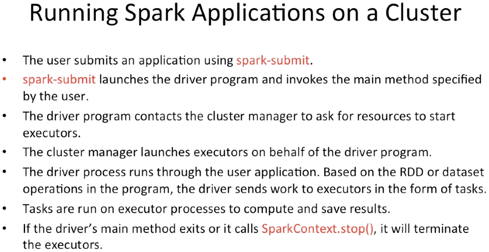
* 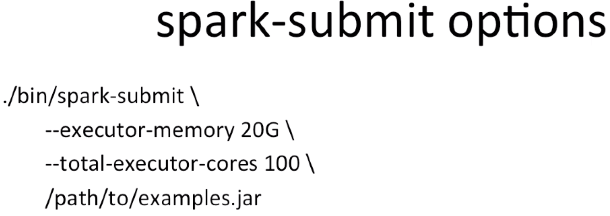
* 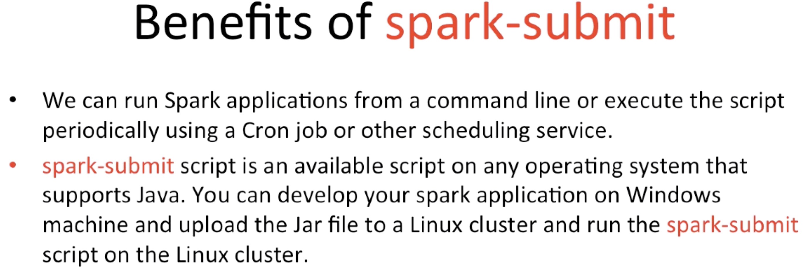

**Run Spark Application On Amazon EMR(Elastic Map Reduce)**
* 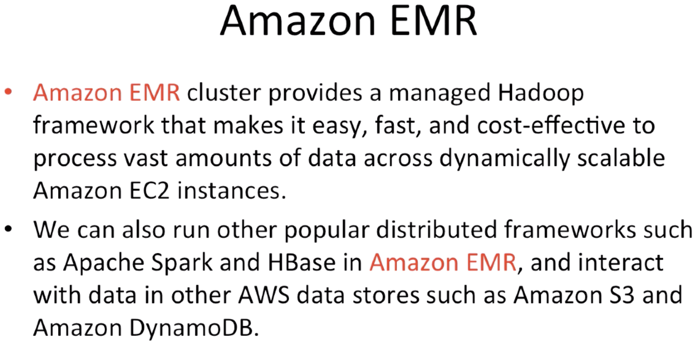
* 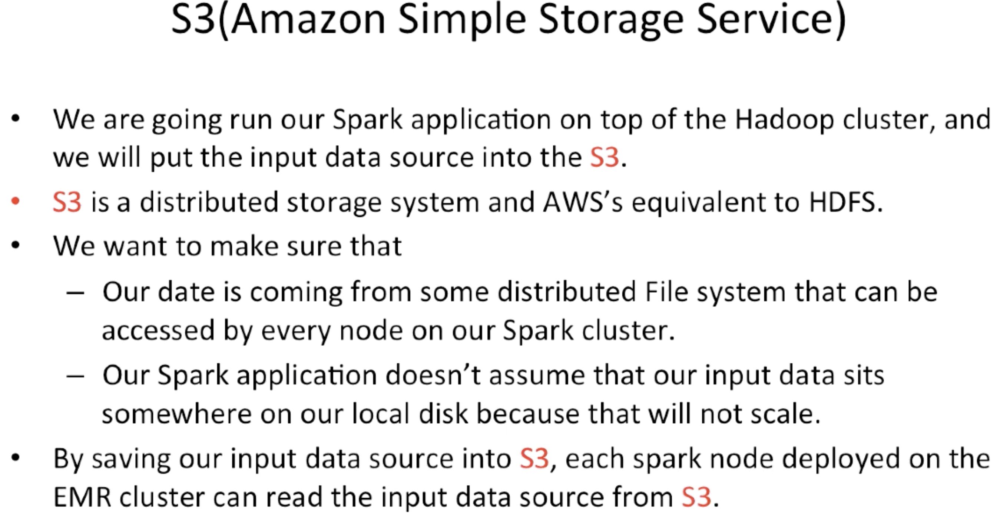  
* AWS is not _FREE_
* AWS charges by how much time and how many machines are running, with given type, any storage space, etc.
* 